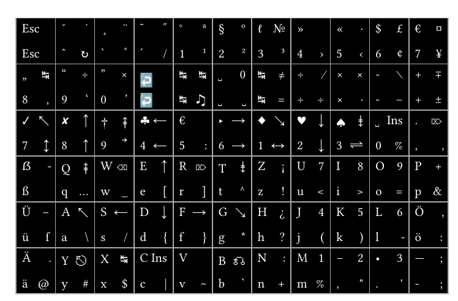
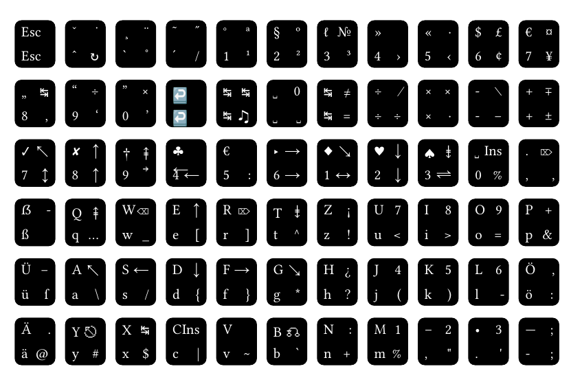
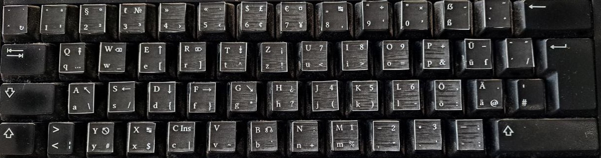

[Neo](https://neo-layout.org/) is a cool keyboard layout with some nice features.
[NeoQwertz](https://neo-layout.org/Layouts/neoqwertz/) is a first stepping stone where most normal keys are still there and only additional layers exist to make typing symbols easier.

However, changing your typing habits is not trivial.
Especially since some keys like underscore are located differently (not Shift+Minus).

A [lookup chart](https://docs.google.com/presentation/d/1zgl3MBwv1Ku4wEC9lU-cv2Mq-qwmVOghOQCYQix8rlk/edit?usp=sharing) can help.
But it is cumbersome to look up keys on an additional sheet (and not intuitive to transfer them to your finger position).
Furthermore, Neo(Qwertz) keycaps are not easy to find.

In this repository, we take the keyboard json mapping from the [ReNeo zip](https://neo-layout.org/Download/) and build stickers to add to your keyboard.

